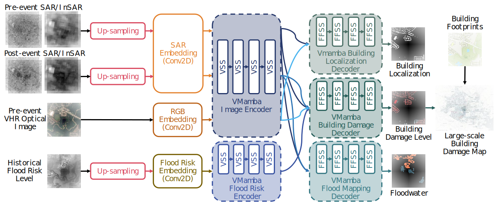

<div align="center">
<h1 align="center">Flood-DamageSense</h1>

<h3>Flood-DamageSense: Multimodal Mamba with Multitask Learning for Building Flood Damage Assessment using SAR Remote Sensing Imagery</h3>

[Yu-Hsuan Ho](https://scholar.google.com/citations?user=UCb9yDoAAAAJ)<sup>a *</sup>, [Ali Mostafavi](https://scholar.google.com/citations?user=DFNvQPYAAAAJ&hl=en)<sup>a </sup>

<sup>a</sup> Urban Resilience.AI Lab, Zachry Department of Civil and Environmental Engineering, Texas A\&M University.

<sup>*</sup> Corresponding author
</div>


[]()

[**Overview**](#overview) | [**Getting Started**](#getting-started) | [**Citation**](#citation)


</div>

## 🛎️Updates
* **` June 09th, 2025`**: The model and scripts for training and inference have been uploaded.


## Overview

* [**Flood-DamageSense**]() serves as the first all-weather, multi-modal model purpose-built for rapid, building-level flood damage assessment by fusing SAR/InSAR, optical imagery, and a flood-risk prior to jointly predict graded damage, flood extent, and building footprints. 

<p align="center">
  
</p>


## Getting Started
### `A. Installation`

**Step 1: Clone the Flood-DamageSense repository:**

Clone this repository and navigate to the project directory:
```bash
git clone https://github.com/violayhho/Flood-DamageSense.git
cd Flood-DamageSense
```


**Step 2: Environment Setup:**

It is recommended to set up a conda environment and installing dependencies via pip. Use the following commands to set up your environment:

***Create and activate a new conda environment***

```bash
conda create -n flooddamagesense
conda activate flooddamagesense
```

***Install dependencies***

```bash
pip install -r requirements.txt
cd kernels/selective_scan && pip install .
```

### `B. Download Pretrained Weight`
Please download the pretrained weights for **VMamba-Tiny** (`vssm_tiny_0230_ckpt_epoch_262.pth`), **VMamba-Small** (`vssm_small_0229_ckpt_epoch_222.pth`), and **VMamba-Base** (`vssm_base_0229_ckpt_epoch_237.pth`) from [VMamba](https://github.com/MzeroMiko/VMamba) and place them in the following directory: 
```bash
{PROJECT_PATH}/Flood-DamageSense/pretrained_weight/
```

### `C. Data Preparation`
[UrbanSARFloods](https://github.com/jie666-6/UrbanSARFloods) and [USBuildingFootprints](https://github.com/microsoft/USBuildingFootprints) are used in the experiments. The other data are confidential.

***Multimodal Dataset***

Please make your dataset have the following folder/file structure:
```
${DATASET_ROOT}   # Dataset root directory, for example: {PROJECT_PATH}/Flood-DamageSense/data
├── UrbanSARFloods_v1
│   └── splits
│       ├── Test_dataset.txt
│       ├── Train_dataset.txt
│       └── Valid_dataset.txt
├── UrbanSARFloods_v1_cut_8
│   ├── 01_NF
│   │   │── SAR
│   │   │   ├── 0170830_Houston_ID_1_0_SAR_0.tif
│   │   │   ...
│   │   └── GT
│   │       ├── 20170830_Houston_ID_1_0_GT_0.tif
│   │       ...      
│   ├── 02_FO
│   │   │── SAR
│   │   │   ├── ...
│   │   │   ...
│   │   └── GT
│   │       ├── ...
│   │       ...
│   └── 03_FU
│       │── SAR
│       │   ├── ...
│       │   ...
│       └── GT
│           ├── ...
│           ...
├── VHR
│   └── pre_event_cut_8
│       ├── 01_NF
│       │   └── GT
│       │       ├── 20170830_Houston_ID_1_0_GT_0.tif
│       │       ...      
│       ├── 02_FO
│       │   └── GT
│       │       ├── ...
│       │       ...
│       └── 03_FU
│           └── GT
│               ├── ...
│               ...
├── damagePlain_cut_8
│   ├── 01_NF
│   │   └── GT
│   │       ├── 20170830_Houston_ID_1_0_GT_0.tif
│   │       ...      
│   ├── 02_FO
│   │   └── GT
│   │       ├── ...
│   │       ...
│   └── 03_FU
│       └── GT
│           ├── ...
│           ...
├── PDE_10240_cut_8
│   ├── 01_NF
│   │   └── GT
│   │       ├── 20170830_Houston_ID_1_0_GT_0.tif
│   │       ...      
│   ├── 02_FO
│   │   └── GT
│   │       ├── ...
│   │       ...
│   └── 03_FU
│       └── GT
│           ├── ...
│           ...
└── USBuildingFootprints_10240_cut_8
    ├── 01_NF
    │   └── GT
    │       ├── 20170830_Houston_ID_1_0_GT_0.tif
    │       ...      
    ├── 02_FO
    │   └── GT
    │       ├── ...
    │       ...
    └── 03_FU
        └── GT
            ├── ...
            ...
```

***Unimodal Dataset (For baseline models)***

Please make your dataset have the following folder/file structure:
```
${DATASET_ROOT}   # Dataset root directory, for example: {PROJECT_PATH}/Flood-DamageSense/data
├── UrbanSARFloods_v1
│   ├── splits
│   │   ├── Test_dataset.txt
│   │   ├── Train_dataset.txt
│   │   └── Valid_dataset.txt
│   ├── 01_NF
│   │   │── SAR
│   │   │   ├── 0170830_Houston_ID_1_0_SAR.tif
│   │   │   ...
│   │   └── GT
│   │       ├── 20170830_Houston_ID_1_0_GT.tif
│   │       ...      
│   ├── 02_FO
│   │   │── SAR
│   │   │   ├── ...
│   │   │   ...
│   │   └── GT
│   │       ├── ...
│   │       ...
│   └── 03_FU
│       │── SAR
│       │   ├── ...
│       │   ...
│       └── GT
│           ├── ...
│           ...
├── PDE
│   ├── 01_NF
│   │   └── GT
│   │       ├── 20170830_Houston_ID_1_0_GT.tif
│   │       ...      
│   ├── 02_FO
│   │   └── GT
│   │       ├── ...
│   │       ...
│   └── 03_FU
│       └── GT
│           ├── ...
│           ...
└── USBuildingFootprints
    ├── 01_NF
    │   └── GT
    │       ├── 20170830_Houston_ID_1_0_GT.tif
    │       ...      
    ├── 02_FO
    │   └── GT
    │       ├── ...
    │       ...
    └── 03_FU
        └── GT
            ├── ...
            ...
```

### `D. Model Training and Inference`
Please enter into [`flooddamagesense`] folder, which contains all the code for network definitions, training and inference. 

```bash
cd {PROJECT_PATH}/Flood-DamageSense/flooddamagesense
```

To train Flood-DamageSense for building-level flood damage assessment, use the following commands for different configurations:
```bash
python script/train_FFMambaBDA.py  --dataset UrbanSARFloods_Fusion \
                                   --batch_size 2 \
                                   --crop_size 512 \
                                   --max_epochs 200 \
                                   --model_type FFMambaBDA_Base
```
To test the performance of Flood-DamageSense and save the outputs:
```bash
python script/infer_FFMambaBDA.py  --dataset UrbanSARFloods_Fusion \
                                   --model_type FFMambaBDA_Base \
                                   --resume ../saved_models/UrbanSARFloods_Fusion/FFMambaBDA_Base/best_ckpt.pth
```

### `E. Baseline Comparison`
To train baseline models, use the following commands for different configurations:
```bash
python script/train_MambaBDA.py  --dataset UrbanSARFloods_Base \
                                 --batch_size 16 \
                                 --crop_size 256 \
                                 --max_epochs 2 \
                                 --model_type STMambaBDA_Base
```
```bash
python script/train_ChangeFormerBDA.py  --dataset UrbanSARFloods_Base \
                                 --batch_size 16 \
                                 --crop_size 256 \
                                 --max_epochs 2 \
                                 --model_type ChangeFormerV1BDA
```
```bash
python script/train_BIT_BDA.py  --dataset UrbanSARFloods_Base \
                                 --batch_size 16 \
                                 --crop_size 256 \
                                 --max_epochs 2 \
                                 --model_type BIT18_BDA
```
```bash
python script/train_SiamUnetBDA.py  --dataset UrbanSARFloods_Base \
                                 --batch_size 16 \
                                 --crop_size 256 \
                                 --max_epochs 2 \
                                 --model_type SeResNext50_Unet_BDA                                                                                                   
```
To test the performance of baseline models and save the outputs:
```bash
python script/infer_MambaBDA.py  --dataset UrbanSARFloods_Base \
                                 --model_type STMambaBDA_Base \
                                 --resume ../saved_models/UrbanSARFloods_Base/STMambaBDA_Base/best_ckpt.pth
```
```bash
python script/infer_ChangeFormerBDA.py  --dataset UrbanSARFloods_Base \
                                 --model_type ChangeFormerV1BDA \
                                 --resume ../saved_models/UrbanSARFloods_Base/ChangeFormerV1BDA/best_ckpt.pth
```
```bash
python script/infer_BIT_BDA.py  --dataset UrbanSARFloods_Base \
                                 --model_type BIT18_BDA \
                                 --resume ../saved_models/UrbanSARFloods_Base/BIT18_BDA/best_ckpt.pth
```
```bash
python script/infer_SiamUnetBDA.py  --dataset UrbanSARFloods_Base \
                                 --model_type SeResNext50_Unet_BDA \
                                 --resume ../saved_models/UrbanSARFloods_Base/SeResNext50_Unet_BDA/best_ckpt.pth
```

## Citation

If this code contributes to your research, please kindly consider citing our paper and give this repo ⭐️ :)
```

```
## Acknowledgments
This project is based on ChangeMamba ([paper](https://ieeexplore.ieee.org/abstract/document/10565926), [code](https://github.com/ChenHongruixuan/ChangeMamba)) and VMamba ([paper](https://proceedings.neurips.cc/paper_files/paper/2024/hash/baa2da9ae4bfed26520bb61d259a3653-Abstract-Conference.html), [code](https://github.com/MzeroMiko/VMamba)). Thanks for their excellent works!!

## Star History

[](https://www.star-history.com/#violayhho/Flood-DamageSense&Date)
